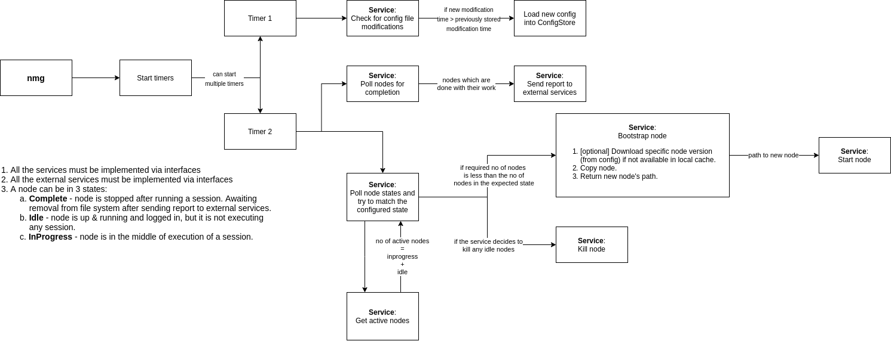
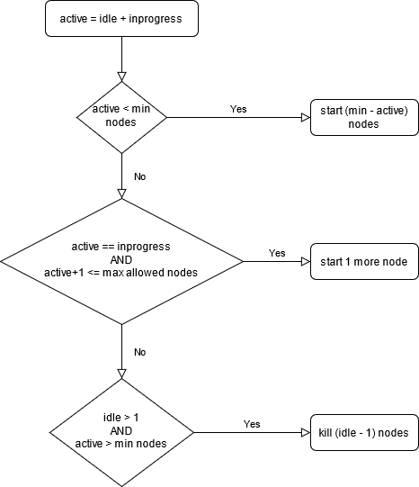

# node_manager
Automatically manage zeuz node instances and external service reporting.



Decision for node to start/kill:

```
active = inprogress + idle

// minimum no of nodes must be started
IF active < min nodes THEN
	start (min - active) nodes

// all nodes are in progress
ELSE IF active == inprogress AND active+1 <= max allowed nodes THEN
	start 1 more node

// kill unnecessary nodes
ELSE IF idle > 1 AND active > min nodes THEN
	kill (idle - 1) nodes

```

Flowchart:


